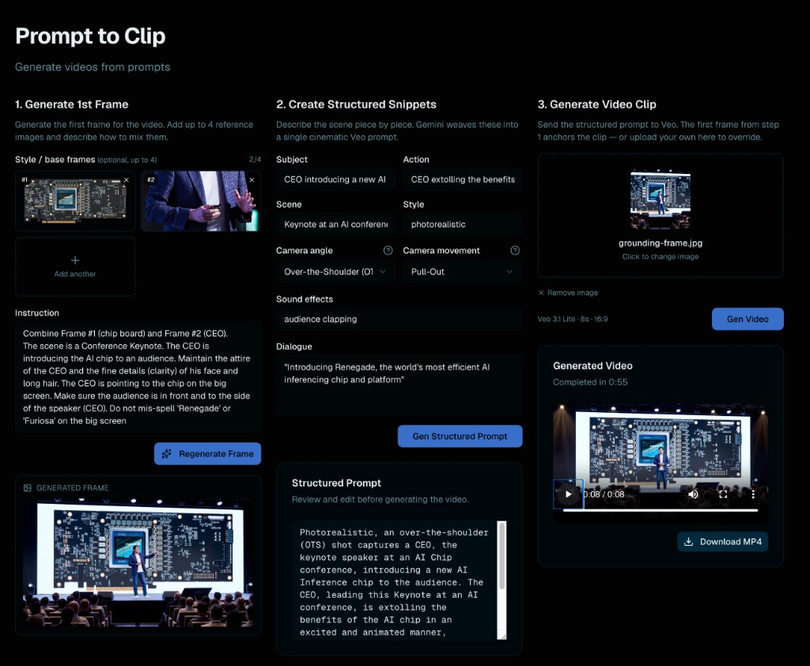

# Soundbite to Shorts

A small local web app that turns a structured prompt into a short video clip,
powered by Google **Gemini** (text + image) and **Veo 3.x** (video). Built as a
UX layer around the workflow demonstrated in `L_3.ipynb`.



The UI is a single page with three numbered panes that mirror the generation
pipeline left-to-right:

1. **Generate 1st Frame** — drop in up to 4 reference images (here: an AI chip
   board and a CEO portrait) and write a mixing instruction. Gemini composes
   them into a single 16:9 grounding frame (the keynote stage shown at the
   bottom of the pane).
2. **Set Soundbite and Scene** — fill in the 8 keyword fields (subject,
   action, scene, style, camera angle, camera movement, sound effects,
   dialogue). Gemini expands them into a single cinematic Veo prompt, which
   appears editable in the **Structured Prompt** card below the button.
3. **Generate Video Short** — the grounding frame from step 1 is auto-attached
   as the reference image (or you can upload your own). Hit **Gen Video** and
   Veo renders an 8-second 16:9 clip. The player below shows status, elapsed
   time, and a **Download MP4** button when it's done.

The example above generated the keynote clip in 55 seconds on
`veo-3.1-lite-generate-preview`.

```
┌─────────────────────────────────────────────────────────────────────────────┐
│  Browser ─────────► Next.js (3000) ────/api/*────► FastAPI (8000) ─────────►│
│                       │                                │                    │
│                       │  rewrites /api/* to            │  google-genai SDK  │
│                       │  http://127.0.0.1:8000         │                    │
│                       │                                ▼                    │
│                       │                       Gemini Dev API ────► Veo 3.x  │
│                       │                                       └─► Gemini    │
│                       │                                              Image  │
│                       │                                       └─► Gemini    │
│                       │                                              Text   │
│                       │                                                     │
│                       └── single `pnpm dev` boots both via `concurrently`   │
└─────────────────────────────────────────────────────────────────────────────┘
```

## Contents

- [Architecture](#architecture)
- [Quick start](#quick-start)
- [Quick restart](#quick-restart)
- [Project layout](#project-layout)
- [Configuration (`.env`)](#configuration-env)
- [API keys (server default vs BYO-key)](#api-keys-server-default-vs-byo-key)
- [REST API](#rest-api)
- [Frontend flow](#frontend-flow)
- [Persistence](#persistence)
- [Error model](#error-model)
- [Helper scripts](#helper-scripts)
- [Deployment (Vercel + Cloud Run)](#deployment-vercel--cloud-run)
- [Troubleshooting](#troubleshooting)

## Architecture

Two processes run side by side, glued by a Next.js dev rewrite:

| Process | Port | Stack | Role |
|---|---|---|---|
| **Next.js** (Turbopack) | `3000` | React 19 + Tailwind 4 + Radix UI + shadcn/ui | Three-pane UI; proxies `/api/*` to FastAPI |
| **FastAPI** (uvicorn `--reload`) | `8000` | Python 3.14, `google-genai`, `python-dotenv` | Talks to Gemini & Veo; runs Veo as a background job |

`pnpm dev` runs both via `concurrently` so a single command boots the whole app.

### Why split?

- The Gemini Python SDK is the reference SDK and matches the source notebook
  (`L_3.ipynb`) exactly — no TS translation risk.
- Long-running Veo jobs (60–300 s) work naturally as a background thread with
  in-memory polling; no serverless timeout traps.
- API keys never reach the browser.

### Backends

Auth and mode are driven entirely by env vars consumed by `google-genai`:

| Mode | Env vars |
|---|---|
| **Gemini Developer API** *(default)* | `GOOGLE_GENAI_USE_VERTEXAI=0` + `GOOGLE_API_KEY=…` |
| **Vertex AI** | `GOOGLE_GENAI_USE_VERTEXAI=1` + `GOOGLE_CLOUD_PROJECT=…` + ADC |

The backend code conditionally enables Vertex-only knobs
(`resolution=720p`, `generate_audio=True`) when `USE_VERTEX` is true. Audio is
generated automatically by Veo 3.x on the Gemini Developer API path.

## Quick start

Prereqs: Node 18+ with `pnpm`, Python 3.11+ with `venv`, a Gemini Developer API
key with Veo access.

```bash
cd /path/to/gen-video

# 1. Install Node deps
pnpm install

# 2. Create Python venv and install API deps
python3 -m venv .venv
.venv/bin/pip install -r api/requirements.txt

# 3. Configure (see "Configuration" below)
cat > .env <<'EOF'
GOOGLE_GENAI_USE_VERTEXAI=0
GOOGLE_API_KEY=<your-aistudio-key>
EOF

# 4. Boot Next.js + FastAPI together
pnpm dev

# 5. Smoke-test the API (in another terminal)
curl -s http://localhost:8000/api/health | python -m json.tool

# 6. Open the app
open http://localhost:3000
```

The `/api/health` call should print something like:

```json
{
  "ok": true,
  "vertex": false,
  "text_model": "gemini-2.5-flash",
  "image_model": "gemini-3.1-flash-image-preview",
  "video_model": "veo-3.1-lite-generate-preview",
  "person_generation": "allow_all",
  "has_default_key": true
}
```

If `has_default_key` is `false`, your `.env` either doesn't have
`GOOGLE_API_KEY` set or the API was already running when you added it — in
the latter case, restart it (uvicorn's `--reload` watches Python files, not
`.env`). When `has_default_key` is `false`, every user must paste a key
into the Settings dialog before generating.

To boot the two halves separately (useful while debugging one side):

```bash
pnpm dev:next   # UI only on :3000
pnpm dev:api    # API only on :8000
```

## Quick restart

When you change something the dev servers don't pick up automatically — most
commonly `.env`, `next.config.mjs`, or `api/requirements.txt` — kill both
halves and reboot:

```bash
pkill -f "next dev"; pkill -f "uvicorn api.main"; pnpm dev
```

What each piece does:

| Step | Why |
|---|---|
| `pkill -f "next dev"` | Stops the Next.js dev server on `:3000`. `-f` matches the full command line (the process is actually `node`); the pattern is specific so it won't touch unrelated `next` invocations. |
| `pkill -f "uvicorn api.main"` | Stops the FastAPI worker on `:8000`. Pattern is scoped to *this* app's uvicorn so other Python projects' uvicorns aren't affected. |
| `pnpm dev` | Boots both halves again under `concurrently` (see `package.json`). |

Notes:

- The semicolons (`;`) are intentional — `&&` would short-circuit if a
  `pkill` finds nothing to kill, leaving you unable to restart from a
  partially-stopped state. `;` keeps going regardless.
- `pkill` is silent on "no matches" except for an exit code; if you'd
  rather suppress the rare "no process found" stderr noise, add
  `2>/dev/null` after each pattern.
- If `pnpm dev` complains *"Address already in use"* on `:3000` or `:8000`,
  a leftover process is still bound. Find it with
  `lsof -nP -iTCP:3000 -sTCP:LISTEN` (or `8000`) and `kill <pid>`.

### When you need this

| Change | Restart? |
|---|---|
| Any `.tsx`, `.ts`, `.css` file | ❌ Next.js HMR handles it |
| Any `.py` file under `api/` | ❌ `uvicorn --reload` handles it |
| `.env` | ✅ — uvicorn doesn't watch `.env` |
| `next.config.mjs` | ✅ — Next.js loads it once at boot |
| `api/requirements.txt` (after `pip install -r`) | ✅ — reload the API to pick up new packages |
| `package.json` (after `pnpm install`) | ✅ |

### Shortcut

The same flow is also wired in as a script, so once you've done it once
the long form, you can just run:

```bash
pnpm restart
```

It does the same thing, plus `2>/dev/null` to suppress the "no process
found" noise and a `sleep 1` to avoid the occasional port-still-in-use
race on tight restarts. Defined in `package.json` as:

```json
"restart": "pkill -f 'next dev' 2>/dev/null; pkill -f 'uvicorn api.main' 2>/dev/null; sleep 1 && pnpm dev"
```

## Project layout

```
gen-video/
├── api/                                  # FastAPI service
│   ├── __init__.py
│   ├── main.py                           # routes + Veo worker
│   ├── error_mapping.py                  # humanize() upstream errors
│   └── requirements.txt
├── app/                                  # Next.js App Router
│   ├── layout.tsx
│   ├── page.tsx                          # 3-column layout, wraps WorkspaceProvider
│   └── globals.css
├── components/                           # React components
│   ├── grounding-frame.tsx               # pane 1 — first-frame generation
│   ├── basic-prompt.tsx                  # pane 2 — 8-field structured snippets
│   ├── structured-prompt.tsx             # pane 2 — editable expanded prompt
│   ├── input-image.tsx                   # pane 3 — reference + Gen Video
│   ├── video-player.tsx                  # pane 3 — playback + download
│   ├── error-banner.tsx                  # shared error rendering
│   └── ui/                               # shadcn/ui primitives
├── lib/                                  # frontend shared modules
│   ├── workspace-context.tsx             # React context + localStorage save/restore
│   ├── api-error.ts                      # ApiError type + fetch parser
│   ├── format.ts                         # model-id + elapsed-time formatters
│   └── utils.ts                          # cn() helper
├── L_3.ipynb                             # source notebook this UI is built on
├── test_veo_access.py                    # one-shot smoke test of Veo access
├── list_video_models.py                  # lists Veo-capable model ids on the key
├── list_image_models.py                  # lists image-output Gemini / Imagen ids
├── next.config.mjs                       # /api/* rewrites to FastAPI
├── package.json                          # pnpm dev orchestrates both processes
└── .env                                  # ← you create this; NOT committed
```

## Configuration (`.env`)

All settings live in `.env` at the project root. Restart the API after editing
(`pkill -f "uvicorn api.main"` — `concurrently` will respawn it).

| Variable | Required | Default | Notes |
|---|---|---|---|
| `GOOGLE_GENAI_USE_VERTEXAI` | yes | `0` | `0` = Gemini Developer API, `1` = Vertex AI |
| `GOOGLE_API_KEY` | when not Vertex *and* no BYO-key | — | from <https://aistudio.google.com/app/apikey>. Acts as the *fallback* key — see [API keys](#api-keys-server-default-vs-byo-key) |
| `GOOGLE_CLOUD_PROJECT` | when Vertex | — | also set up ADC via `gcloud auth application-default login` |
| `GOOGLE_CLOUD_LOCATION` | when Vertex | `us-central1` | |
| `TEXT_MODEL_ID` | no | `gemini-2.5-flash` | used by `POST /api/structured-prompt` |
| `IMAGE_MODEL_ID` | no | `gemini-3.1-flash-image-preview` | used by `POST /api/grounding-frame` |
| `VIDEO_MODEL_ID` | no | `veo-3.1-fast-generate-preview` | used by `POST /api/videos` |
| `PERSON_GENERATION` | no | `allow_all` (Gemini API), `allow_adult` (Vertex) | accepted values vary by model; `dont_allow` is universally safe |
| `VEO_POLL_SECONDS` | no | `15` | how often the worker polls Veo's long-running op |
| `VEO_TIMEOUT_SECONDS` | no | `600` | max wait before the job is marked timed out |
| `API_PROXY_TARGET` | no | `http://127.0.0.1:8000` | only used by `next.config.mjs` when proxying |

Confirm what's actually active at any time via `GET /api/health`. The
response now also includes `has_default_key`, which the UI reads to decide
whether to show a "no key set" warning in the Settings dialog.

## API keys (server default vs BYO-key)

Two ways to authenticate against Gemini / Veo, transparently coexisting:

1. **Server default** — set `GOOGLE_API_KEY` (or `GEMINI_API_KEY`) in `.env`
   and every request uses it. Simple, billed to you. Best for personal /
   private use, demos you control, or single-tenant deploys.
2. **BYO-key (recommended for public deploys)** — leave `GOOGLE_API_KEY`
   unset and require each user to paste their own key in the **Settings**
   dialog (gear icon, top-right of the app). Their key:
   - is saved only in browser `localStorage` (key: `gen-video:api-key:v1`);
   - is sent on each generation request as an `X-Goog-Api-Key` header;
   - is **never logged or persisted server-side** (the FastAPI app builds a
     per-request `genai.Client(api_key=…)` and discards it when the response
     is sent — Veo jobs carry the key into the worker thread the same way).

Both can be used together: if a user has saved a key, theirs wins; if they
haven't, the server default is used. If neither exists, the API returns
**`401 AUTH`** with a friendly hint pointing at the Settings dialog.

Status indicator in the Settings button:

| Color | Meaning |
|---|---|
| Green dot | User has saved their own key (will be used). |
| Amber dot | Server has no default key **and** user hasn't saved one — generation will fail until they do. |
| No dot | User hasn't saved one, but the server default is configured (so generation works on the server's bill). |

To force BYO-key on a public deploy, simply do not set `GOOGLE_API_KEY` in
the API host's env. The amber dot makes the requirement obvious.

## REST API

All routes are prefixed with `/api`. From the browser they're reached via the
Next.js proxy (`http://localhost:3000/api/...`); from `curl` / scripts you can
hit FastAPI directly (`http://localhost:8000/api/...`).

**Auth header (all generation routes):** the three generation endpoints
(`structured-prompt`, `grounding-frame`, `videos`) accept an optional
`X-Goog-Api-Key: <user-key>` header. When present it overrides the server's
`GOOGLE_API_KEY` for that request. See
[API keys](#api-keys-server-default-vs-byo-key).

### `GET /api/health`

Returns the active runtime config. Good first sanity check.

```bash
curl -s http://localhost:8000/api/health
```

```json
{
  "ok": true,
  "vertex": false,
  "text_model": "gemini-2.5-flash",
  "image_model": "gemini-3.1-flash-image-preview",
  "video_model": "veo-3.1-lite-generate-preview",
  "person_generation": "allow_all",
  "has_default_key": true
}
```

`has_default_key` is `true` when the server has `GOOGLE_API_KEY` (or is in
Vertex mode); when `false`, clients must supply `X-Goog-Api-Key` on every
generation call.

### `POST /api/structured-prompt`

Expand 8 keyword snippets into one cinematic Veo prompt via Gemini text.

**Request** (`application/json`):

```json
{
  "subject": "a professor",
  "action": "explaining the Pythagorean theorem",
  "scene": "in a classroom",
  "style": "photorealistic",
  "camera_angle": "eye-level shot",
  "camera_movement": "slow zoom in",
  "sound_effects": "chalk on board",
  "dialogue": "The square on the hypotenuse equals…"
}
```

All fields are optional individually; at least one must be non-empty.

**Response** (`200 OK`):

```json
{ "prompt": "A photorealistic, eye-level shot inside a classroom…" }
```

**Errors**: see [Error model](#error-model).

### `POST /api/grounding-frame`

Generate a 16:9 first ("grounding") frame for Veo. Accepts an optional set of
reference frames mixed with a text instruction.

**Request** (`multipart/form-data`):

| Field | Required | Repeatable | Notes |
|---|---|---|---|
| `instruction` | yes | no | natural-language description; refers to frames as "image 1", "image 2", etc. |
| `style_frames` | no | yes (1–N) | reference images; sent to the model as `Part.from_bytes` parts in order |

Accepted image MIMEs upstream: PNG, JPEG, WebP, HEIC, HEIF. Avoid GIF / BMP / SVG / AVIF.

**Response** (`200 OK`): raw PNG bytes, `Content-Type: image/png`.

```bash
curl -s -X POST http://localhost:8000/api/grounding-frame \
  -F instruction='A chef slicing tomatoes in a bright kitchen' \
  -F style_frames=@chef.png \
  -F style_frames=@kitchen.png \
  -o grounding.png
```

**Errors**: in addition to generic upstream errors, this route surfaces
safety-block specifics:

- `BLOCKED` — the *instruction* tripped a prompt filter (`prompt_feedback.block_reason`).
- `REFUSED` — the model returned a candidate but with no `parts`
  (typical safety / recitation refusal). `finish_reason` is included.

### `POST /api/videos`

Submit a Veo job. Returns a `job_id` immediately; the actual Veo call runs in
a background thread that polls Veo's long-running operation.

**Request** (`multipart/form-data`):

| Field | Required | Notes |
|---|---|---|
| `prompt` | yes | the (typically expanded) structured prompt |
| `image` | no | optional first-frame reference image |

**Response** (`200 OK`):

```json
{ "job_id": "b449778cb10d4758a623eb0da7bf38ae" }
```

```bash
curl -s -X POST http://localhost:8000/api/videos \
  -F prompt='A professor at a chalkboard, slow zoom in.' \
  -F image=@grounding.png
```

### `GET /api/videos/{job_id}`

Poll job status. The UI calls this every 5 s while a job is in flight.

**Response** (`200 OK`):

```json
{
  "status": "queued | running | done | error",
  "error":  null,
  "elapsed_seconds": 47
}
```

When `status == "error"`, the `error` field is a structured `ApiError` (see
[Error model](#error-model)).

### `GET /api/videos/{job_id}/file`

Stream the MP4 bytes for a completed job.

- `200 OK` — `Content-Type: video/mp4`, body is the file.
- `409 JOB_NOT_READY` — job is still running or errored.
- `404` — unknown id.

Used both by the `<video>` element and the **Download MP4** button (which sets
the `download` attribute on an anchor).

## Frontend flow

The UI is a single page (`app/page.tsx`) wrapped in a `WorkspaceProvider`
context. State is shared across three panes; each pane "owns" a step.

```
┌──────────────────────┐  ┌──────────────────────┐  ┌──────────────────────┐
│ 1. Generate 1st Frame│  │ 2. Create Structured │  │ 3. Generate Video    │
│                      │  │     Snippets         │  │     Clip             │
│ • style/base frames  │  │ • 8 keyword fields   │  │ • optional ref image │
│   (0–4, multi-select)│  │   (subject, action,  │  │   (auto-filled from  │
│ • text instruction   │  │   scene, style,      │  │   pane 1 or upload)  │
│ • Gen 1st Frame /    │  │   camera angle 🔽,   │  │ • model · 8s · 16:9  │
│   Regenerate         │  │   camera movement 🔽,│  │ • Gen Video          │
│ • preview (with      │  │   sound, dialogue)   │  │ • polling spinner    │
│   spinner overlay)   │  │ • Gen Structured     │  │ • model + elapsed    │
│                      │  │   Prompt             │  │ • <video> + Download │
│                      │  │ • editable result    │  │                      │
└──────────────────────┘  └──────────────────────┘  └──────────────────────┘
```

Key state held in `lib/workspace-context.tsx`:

| Field | Type | Purpose |
|---|---|---|
| `keywords` | `{ subject, action, scene, style, cameraAngle, cameraMovement, soundEffects, dialogue }` | the 8 form fields (auto-saved) |
| `groundingInstruction` | string | text instruction for the first frame (auto-saved) |
| `structuredPrompt` | string | Gemini's expanded prompt; user-editable (auto-saved) |
| `imageFile` | `File \| null` | the active reference image (NOT saved; re-upload after refresh) |
| `jobId` / `jobStatus` / `jobError` / `jobStartedAt` | job tracking | drives the spinner + elapsed counter |
| `videoModel` | string | fetched once from `/api/health` on mount, drives the model badge |

## Persistence

Two layers, intentionally simple:

1. **Browser `localStorage`** — auto-saves the four text fields (8 keywords,
   structured prompt, grounding instruction) under a single versioned key
   `gen-video:workspace:v1`. Restores on next page load. Images are *not*
   persisted (File objects can't go into localStorage cleanly).

   Debug from DevTools → Console:
   ```js
   JSON.parse(localStorage.getItem('gen-video:workspace:v1'))
   localStorage.removeItem('gen-video:workspace:v1')   // reset all text
   ```

2. **Browser `localStorage` (API key)** — saved separately under
   `gen-video:api-key:v1` so a "reset workspace" doesn't wipe it (and so
   it can be cleared independently from the Settings dialog). Sent only as
   `X-Goog-Api-Key` to our own `/api/*` proxy.

   ```js
   localStorage.getItem('gen-video:api-key:v1')
   localStorage.removeItem('gen-video:api-key:v1')   // same as "Clear saved key"
   ```

3. **JSON snapshot file (Prompts menu)** — the **Prompts** button in the
   page header (next to **Settings**) lets you take the workspace data
   *out* of the browser:

   - **Export prompts (JSON)** downloads
     `soundbite-to-shorts-<timestamp>.json` containing the same shape stored
     in `gen-video:workspace:v1` (8 keywords + structured prompt + grounding
     instruction). Use this for backup, sharing, or cross-device transfer.
   - **Import prompts (JSON)** loads a previously exported file back into
     the workspace. The schema is validated (`version: 1`); files that don't
     match are rejected with a clear error.
   - **Reset prompts…** clears all typed text and uploaded images after a
     confirmation. The API key is preserved (it's in its own localStorage
     key, see #2).

   Images and generated MP4s are intentionally **not** in the snapshot —
   the JSON stays human-readable and small, and binary blobs don't really
   belong in a "prompt" anyway.

4. **Server-side `_jobs` dict** — in-memory only, keyed by `job_id`. Holds
   the MP4 bytes and status until the API process restarts. Manual download
   via the UI's **Download MP4** button is currently the only way to keep a
   clip across restarts. Server-side persistence to disk is a Tier-2 TODO.

## Error model

Every non-2xx response uses the same JSON shape:

```json
{
  "detail": {
    "code":      "MODEL_NOT_FOUND",
    "message":   "The model `foo` isn't available on this API key while generating the video.",
    "hint":      "Run `python list_video_models.py`…",
    "technical": "ClientError: 404 NOT_FOUND. {'error': …}"
  }
}
```

Job-status payloads use the same `ApiError` under the `error` field when
`status == "error"`.

The frontend renders this via `components/error-banner.tsx`: bold message,
smaller hint, collapsible "Show technical details". Backend mapping lives in
`api/error_mapping.py`. Recognized categories:

| `code` | Trigger |
|---|---|
| `USER_ERROR` | input validation (empty prompt, missing file, etc.) |
| `MODEL_NOT_FOUND` | `models/X is not found` / `NOT_FOUND` |
| `AUTH` | `PERMISSION_DENIED`, `UNAUTHENTICATED`, 401, 403 |
| `QUOTA` | `RESOURCE_EXHAUSTED`, 429 |
| `IMAGE_FORMAT` | unsupported image mime |
| `PERSON_GEN` | `person_generation` value rejected |
| `BLOCKED` | prompt-level safety block (image model) |
| `REFUSED` | candidate-level safety refusal (image model) |
| `POLICY` | generic content-policy rejection |
| `UPSTREAM` | 500, 503, `UNAVAILABLE` |
| `TIMEOUT` | `TimeoutError` or "timed out" |
| `INVALID_ARGUMENT` | generic 400 from upstream |
| `JOB_NOT_READY` | hitting `/file` before status is done |
| `EMPTY_RESPONSE` | model returned an empty / partless response |
| `UNKNOWN` | fallback |

Most messages include the step that failed (`"…while generating the first
frame."` / `"…while expanding the prompt."` / `"…while generating the video."`)
so it's clear which model is responsible.

## Helper scripts

- **`test_veo_access.py`** — runs a single Veo render end-to-end using your
  `.env` and writes `veo_smoke_test.mp4`. The fastest way to confirm Veo
  access on a new key.
  ```bash
  .venv/bin/python test_veo_access.py
  ```
- **`list_video_models.py`** — lists every model on your API key that supports
  `predictLongRunning` (Veo).
- **`list_image_models.py`** — lists Gemini multimodal image models and Imagen
  models on your key.

## Deployment (Vercel + Cloud Run)

The same `/api/*` proxy that glues the two processes in dev also works in
production: the **Next.js frontend deploys to Vercel** and the **FastAPI
backend deploys to Google Cloud Run**. Vercel rewrites `/api/*` to the Cloud
Run URL, so the browser only ever talks to one origin (no CORS).

```
Browser ──► Vercel (Next.js) ──/api/*──► Cloud Run (FastAPI) ──► Gemini / Veo
                 rewrite via API_PROXY_TARGET
```

### Why this split

Vercel serverless functions can't host the backend well: the Veo job polls for
up to ~10 min in a background thread and keeps job state in memory — both die
under serverless timeouts and scale-to-zero. Cloud Run keeps a warm container
with CPU always allocated, so the worker thread survives. The frontend, by
contrast, is a perfect Vercel fit.

### Backend → Cloud Run

Files: [`Dockerfile`](./Dockerfile), [`.dockerignore`](./.dockerignore),
[`deploy-backend.sh`](./deploy-backend.sh). The image is built in the cloud via
Cloud Build, so **no local Docker is needed**.

```bash
# one-time
gcloud auth login
gcloud config set project YOUR_PROJECT_ID
gcloud services enable run.googleapis.com cloudbuild.googleapis.com

# deploy (server-side key optional; omit for BYO-key mode)
PROJECT_ID=YOUR_PROJECT_ID REGION=us-central1 \
  GOOGLE_API_KEY=your-gemini-key \
  ./deploy-backend.sh
```

The script deploys with deliberate flags:

| Flag | Why |
|---|---|
| `--no-cpu-throttling` | keep CPU on so the background Veo polling thread runs between requests |
| `--min-instances 1` / `--max-instances 1` | one warm instance so the in-memory `_jobs` table stays consistent across status/file polls |
| `--memory 1Gi` | holds the SDK plus a few-MB MP4 in memory |
| `--timeout 300` | submit/status/file calls are quick |
| `--allow-unauthenticated` | the frontend proxies anonymously |

It prints the service URL (and `…/api/health`) when done.

> **Scaling note:** the single-instance setup is intentional because job state
> and video bytes live in memory. To scale horizontally, externalize job state
> (e.g. Firestore/Redis) and store MP4s in GCS, then raise `--max-instances`.

> **TODO — harden the Gemini key into Secret Manager.** The current deploy
> passes `GOOGLE_API_KEY` as a plaintext Cloud Run env var (fine for testing,
> visible to anyone with project access). Move it to Secret Manager and mount
> it instead:
>
> ```bash
> echo -n "YOUR_GEMINI_KEY" | gcloud secrets create gemini-api-key --data-file=-
> # grant the Cloud Run runtime service account read access, then redeploy with:
> gcloud run services update soundbite-api --region us-central1 \
>   --set-secrets GOOGLE_API_KEY=gemini-api-key:latest
> ```
>
> Then drop `GOOGLE_API_KEY` from `deploy-backend.sh`'s `--set-env-vars`.

### Frontend → Vercel

1. Import the GitHub repo into Vercel (framework auto-detected as Next.js).
2. Set an env var **`API_PROXY_TARGET`** = the Cloud Run URL from the deploy
   step (e.g. `https://soundbite-api-xxxx.us-central1.run.app`).
3. Deploy. `next.config.mjs` reads `API_PROXY_TARGET` and rewrites `/api/*`
   to Cloud Run; locally it still falls back to `http://127.0.0.1:8000`.

If you set a server-side `GOOGLE_API_KEY` on Cloud Run, the app works out of the
box; otherwise users supply their own key in the UI (BYO-key mode).

## Troubleshooting

**First check, always:** `curl -s http://localhost:8000/api/health | python -m json.tool`.
This one call confirms the API is up, tells you which `text_model` /
`image_model` / `video_model` are actually loaded, what `person_generation`
mode is active, and whether the server has a default key (`has_default_key`).
Most "the app stopped working" investigations end here — usually with "I
edited `.env` but didn't restart the API."

**`401 AUTH … No API key`.** Either the server has no `GOOGLE_API_KEY` *and*
the user hasn't pasted one into the Settings dialog (the gear icon shows an
amber dot in that case), or the saved key was revoked. Open Settings, paste
a valid AI Studio key, save. See [API keys](#api-keys-server-default-vs-byo-key).

**`Failed to proxy http://127.0.0.1:8000/... ECONNRESET` in the Next logs.**
The browser cancelled the request — usually because the page was hard-reloaded
mid-call. The API still finished the work (you'll see a `200 OK` in the
adjacent `[api]` line) but the response was dropped. The app is fine; don't
hard-reload mid-generation.

**`429 RESOURCE_EXHAUSTED while generating the video`.** Per-minute or per-day
Veo quota. Wait a minute first; if it persists, swap `VIDEO_MODEL_ID` to a
sibling tier — each model has its own quota pool. The current list of models
on your key is one `python list_video_models.py` away.

**`400 INVALID_ARGUMENT … person_generation`.** Veo 3.x on the Gemini Developer
API only accepts certain `person_generation` values per model:
- **Veo 3.1** family: `allow_all` works.
- **Veo 3.0** family: only `dont_allow` works.

Set `PERSON_GENERATION` in `.env` to match the chosen `VIDEO_MODEL_ID`.

**Grounding-frame refused (`REFUSED` with `finish_reason: SAFETY`).** Your
instruction or reference photo named/identified a real person, brand, or
sensitive scenario. Rephrase abstractly ("a tech CEO" rather than naming
them), or drop the most identifiable reference image.

**Port 5000 is in use on macOS.** The macOS AirPlay Receiver claims port 5000.
We run on port 3000 instead. Edit `package.json` scripts if you need a
different port; remember to also update `API_PROXY_TARGET` if you move the
Python API.

**Empty / black video.** Sometimes Veo emits a near-black 8-second clip when
the prompt was ambiguous or partially blocked. Try a more concrete subject and
action, and a clearer first frame.

---

Built on top of [`L_3.ipynb`](L_3.ipynb), which contains the original
notebook flow this UI codifies.
